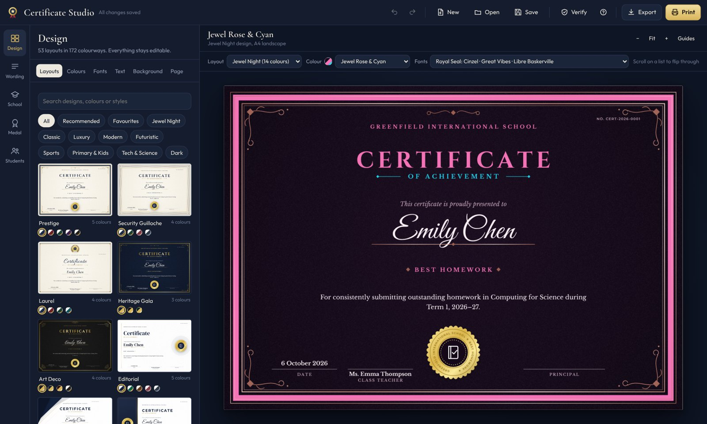
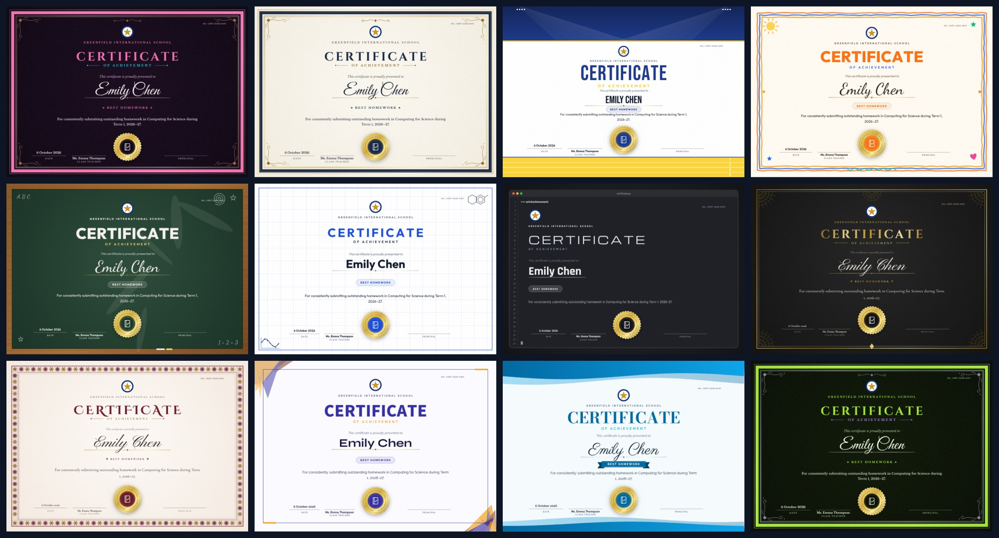
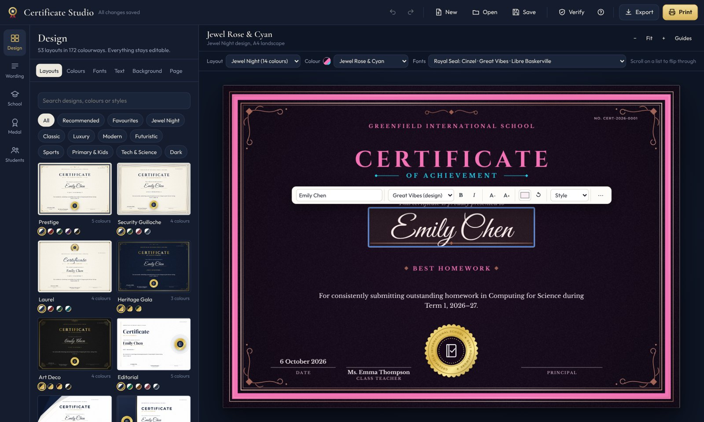
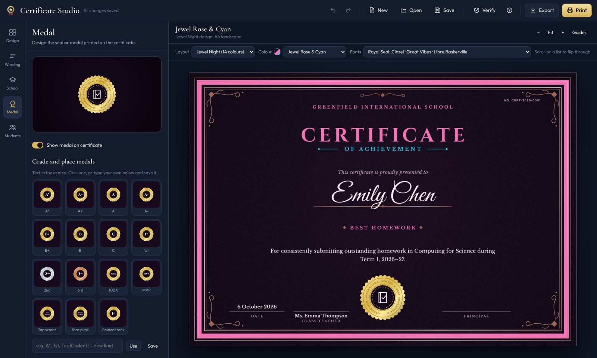
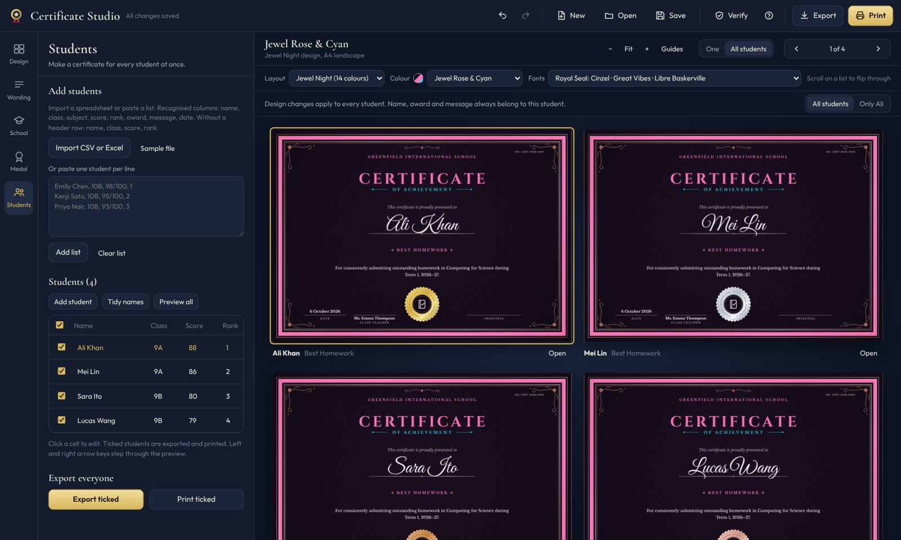
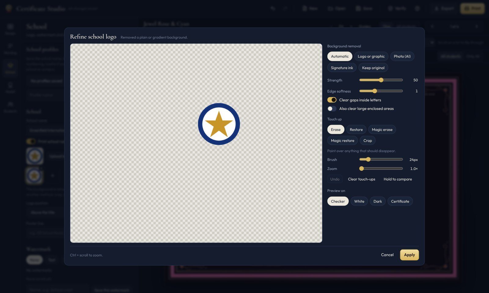

# Certificate Studio

**Beautiful school certificates in minutes. Offline, private and free to use.**

Homework awards, exam toppers, sports days, house points, graduation, staff thanks: pick a design, add your school logo and a class list, and print or export a certificate for every student at once.

[**⬇ Download for Windows**](../../releases/latest) &nbsp;·&nbsp; [What's new](CHANGELOG.md) &nbsp;·&nbsp; [Report a problem](../../issues/new/choose)

## Why teachers use it

- **53 layouts in 172 colourways**: classic, luxury, modern, futuristic, sports, primary and kids, tech and science, and the dark "Jewel Night" collection.
- **98 ready-made award types** with matching wording, medal icon and background, from Best Homework to Most Improved and Sports Day winners.
- **A whole class in one go**: paste names or import an Excel/CSV file, then export one PDF, a ZIP of PDFs or images, or print them all.
- **Click anything to edit it**: a floating format bar appears over the name, title or medal, just like in Word.
- **Your own branding**: several school logos, smart watermarks that adjust to each design, signatures with automatic background removal.
- **Medal designer**: 18 shapes, 14 metals, laurel/olive/oak branches, stars and crowns, grade medals (A*, A+, 1st, 2nd, 3rd) or your own text.
- **Works fully offline**: no account, no internet needed, and student names never leave your computer.

## Download and install

1. Open the [latest release](../../releases/latest) and download **Certificate-Studio-Windows.exe**.
2. Double-click it. There is nothing to install.
3. Windows may show **"Windows protected your PC"** because the app is new and not yet code-signed. Click **More info → Run anyway**.

**Requirements:** Windows 10 or 11 (64-bit). The app uses Microsoft Edge WebView2, which is already on Windows 11 and most Windows 10 PCs. If the app opens to a blank window, install the free [WebView2 Runtime](https://developer.microsoft.com/microsoft-edge/webview2/#download-section).

**Updates:** the app tells you when a new version is available (Help → Check for updates). Download the new `.exe` and replace the old one. Your saved work stays where it is.

## Feature tour

| | |
|---|---|
|  | **Click to edit.** Change the text, font, bold, italic, size, colour and style right on the certificate. Double-click for every option. |
|  | **Medal designer.** Shapes, metals, ribbons, branches, stars, crowns, icons by subject (computer science, biology, chemistry, physics, sports…) and grade or place medals. |
|  | **Every student at once.** Edit names in a table, tick who to include, give one student a different design, and scroll through every certificate before printing. |
|  | **Clean logos from any picture.** Remove backgrounds from logos, signatures and photos (including an offline AI mode), then touch up with a brush. |

### Everything else

- Paper sizes: A4, US Letter, A5, A3, Legal; landscape or portrait
- Export: one PDF, PDFs in a ZIP, PNG or JPG, at 150 or 300 dpi, with optional 3 mm bleed and crop marks for print shops
- Print on plain paper, or **pre-printed certificate paper** (prints only the words, with fine position adjustment and a test page)
- Use your own design: upload a PNG, JPG or PDF background and type over it
- 24 professional font pairings, plus fonts installed on your computer or your own font files
- Certificate numbers, QR codes, and **verification codes** with an Excel issue register and a Verify tool
- School profiles for more than one school or campus
- Undo/redo, keyboard shortcuts, mouse-wheel controls, automatic saving

## Privacy

Certificate Studio runs entirely on your computer. It does not collect, upload or share any data. The only network request is an optional check of this page for a newer version; it sends no personal information.

## Questions and feedback

- Found a bug? [Report it here](../../issues/new?template=bug_report.yml).
- Have an idea? [Suggest a feature](../../issues/new?template=feature_request.yml).

## Licence

Free to download and use for personal and school purposes. See [LICENSE](LICENSE.md). © 2026 Syed1337. All rights reserved.
